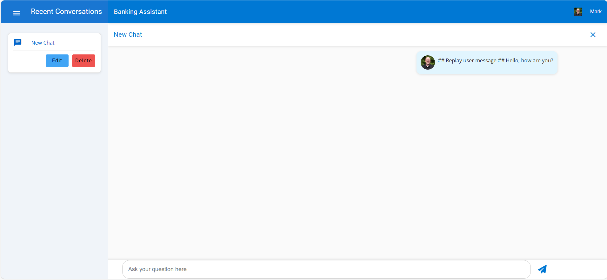

# Module 00 - Configure local lab resources

## Introduction

In this Module, you'll configure the lab resources then start the application to ensure everything has been properly configured.

1. Open a browser locally on the VM and navigate to +++https://portal.azure.com+++
1. Login using the credentials below
1. User name +++@lab.CloudPortalCredential(User1).Username+++
1. Password +++@lab.CloudPortalCredential(User1).Password+++
1. In the Search box at the top of the Azure Portal, type in `resource group`. Open the Resource groups blade
1. Open the resource group that starts with: *rg-agenthol-*.
1. Open the Cosmos DB account and navigate to Data Explorer.
1. Leave this browser open to the Azure Portal. We will refer to it again later in this lab.
1. Proceed to [Running the App](#running-the-app)

## Running the App

### Start the Backend App

1. Open VS Code from the desktop.
1. This should open this folder by default, *"C:\Users\LabUser\multi-agent-hol\"*. If not, navigate to an open this folder.
1. From the menu, select Terminal, New Terminal, then open a new PowerShell terminal.
1. Navigate to *csharp\src\MultiAgentCopilot*.

```shell
cd csharp\src\MultiAgentCopilot
```

1. Type `dotnet run` to start the multi-agent service.
1. You will notice some warnings when the app starts. You can ignore these.
1. When you see *Semantic Kernel service initialized* the app has started.
1. Leave the app running.

### Run the Frontend App

1. Within VS Code, open a new terminal.
1. Navigate to the *frontend* folder.

```shell
   cd frontend
   ```

1. Copy and run the following:

   ```shell
   npm install
   npm start
   ```

1. If prompted, **Allow** so the Node.js Javascript Runtime to access this app over the network.
1. Open your browser and navigate to `http://localhost:4200/`.

### Start a Conversation

1. In the Login dialog, select a user and company and click, Login.
1. Start a new conversation.
1. Send the message:

   ```text
   Hello, how are you?
   ```

1. You should see something like the output below.

   

### Stop the Application

- Return to VS Code.
- In the frontend terminal, press **Ctrl + C** to stop the frontend application.
- Select the backend terminal, press **Ctrl + C** to stop the backend application.

## Next Steps

Proceed to Module 1: Creating Your First Agent
