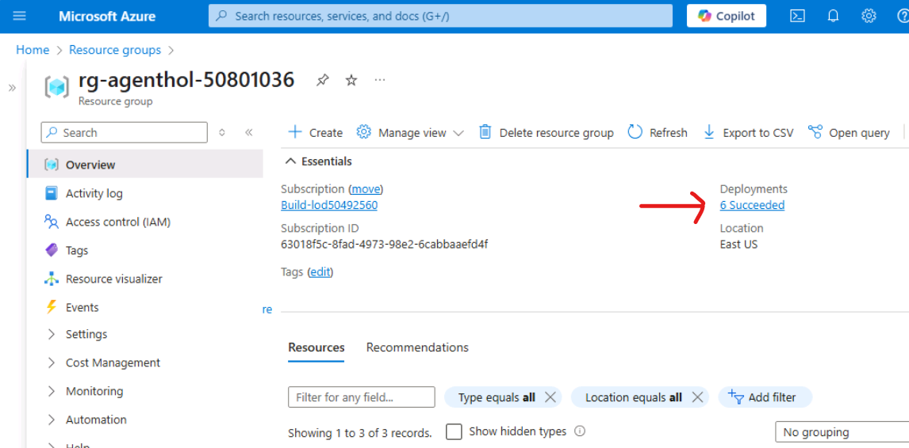

# Module 00 - Deployment and Setup

## Introduction

In this Module, you'll confirm the deployment of Azure Services needed to run this workshop.

1. Open the folder on the desktop *LabUser - Shortcut*
1. Navigate to the *multi-agent-hol* folder.
1. If the folder is not empty, proceed to the next step. If it is empty or does not exist, proceed to [Lab Provisioning](#lab-provisioning)

1. Open a browser locally on the VM and navigate to +++https://portal.azure.com+++
1. Login using the credentials below
   1. User name +++@lab.CloudPortalCredential(User1).Username+++
   1. Password +++@lab.CloudPortalCredential(User1).Password+++
1. Scroll down and look for a resource group that starts with: *rg-agenthol-*.
1. If the resource group does not appear wait a few moments then refresh.
1. When the new resource group appears, expand the Overview tab and click deployments.

1. If all resources have been deployed successfully, you are ready to begin the lab. Your screen should look like this.

1. Proceed to [Running the App](#running-the-app)

## Lab Provisioning

1. Within the terminal navigate up to the LabUser folder.
1. Clone the GitHub repository for this lab.

```shell
cd C:\Users\LabUser
git clone --branch hol --single-branch https://github.com/AzureCosmosDB/banking-multi-agent-workshop.git C:\Users\LabUser\multi-agent-hol
cd C:\Users\LabUser\multi-agent-hol\
```

1. Authenticate the local user using the credentials provided here
   1. User name +++@lab.CloudPortalCredential(User1).Username+++
   1. Password +++@lab.CloudPortalCredential(User1).Password+++

```shell
azd auth login
```

1. Deploy the Azure services
   1. For environment name enter: `agenthol`
   1. Press enter to select the subscription listed.
   1. Press enter to select the default region listed.

```shell
azd up
```

1. Return to the Azure Portal and refresh the list of resource groups.
1. Select the *rg-agenthol* resource group.
1. Find the collapsed *Essentials* section at the top of the page and expand.
1. Click on the Deployments and watch until the status of all deployed resources shows as Succeeded.
1. Your screen should appear as below.


## Running the App

### 1. Start the ChatAPI

1. Open the folder on the desktop to the LabUser folder.
1. Navigate to `C:\Users\LabUser\multi-agent-hol\src\MultiAgentCopilot`.
1. Type `code .`
1. Press **F5** or select **Run** to start the application.
1. Copy the URL from the browser window that opens.

#### 2. Run the Frontend App

1. Open a new terminal. Navigate to the `frontend` folder.
1. Copy and run the following:

   ```sh
   npm install
   npm start
   ```

##### If running locally

1. Open your browser and navigate to <http://localhost:4200/>.

#### 3. Start a Conversation

1. Open the frontend app.
1. Start a new conversation.
1. Send the message:

   ```text
   Hello, how are you?
   ```

1. You should see something like the output below.

   

#### 4. Stop the Application

- In the frontend terminal, press **Ctrl + C** to stop the application.
- In your IDE press **Shift + F5** or stop the debugger.
- If you are in CodeSpaces, go to each terminal and press **Ctrl + C**.

### Deployment Validation

Use the steps below to validate that the solution was deployed successfully.

- [ ] All Azure resources are deployed successfully
- [ ] You can compile the solution in CodeSpaces or locally
- [ ] You can start the project and it runs without errors
- [ ] You are able to launch the Chat Frontend app , create a new chat session, and get a reply when you send a message.

### Common Issues and Troubleshooting

1. Errors during azd deployment:
   - Service principal "not found" error.
   - Rerun `azd up`
1. Frontend issues:
   - If frontend doesn't fully start, navigate to `/frontend/src/environments/environment.ts` and update `apiUrl: 'https://localhost:63279/'`
   - Frontend will restart

## Success Criteria

To complete this Module successfully, you should be able to:

- Verify that all services have been deployed successfully.
- Have an open IDE or CodeSpaces session with the source code and environment variables loaded.
- Be able to compile and run the application with no warnings or errors.

## Next Steps

Proceed to Module 1: Creating Your First Agent
